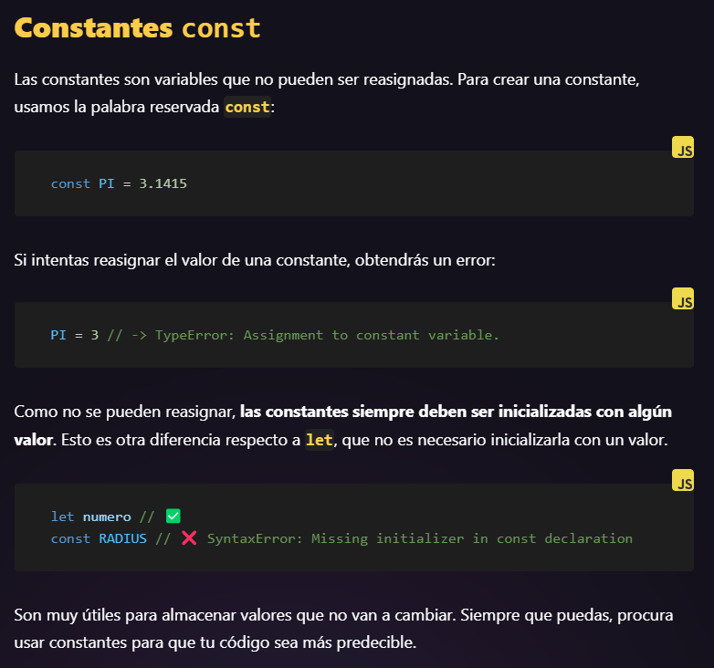
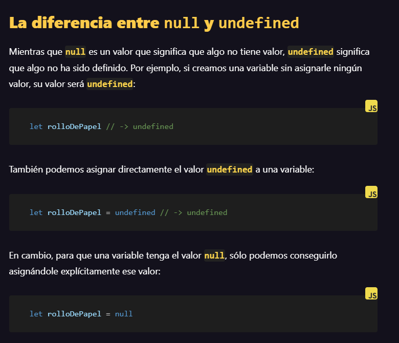
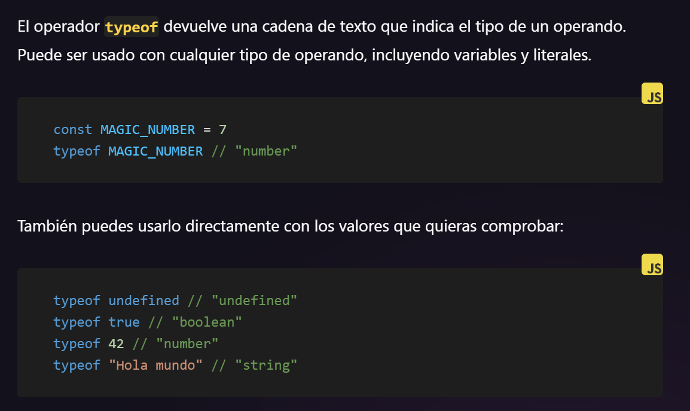
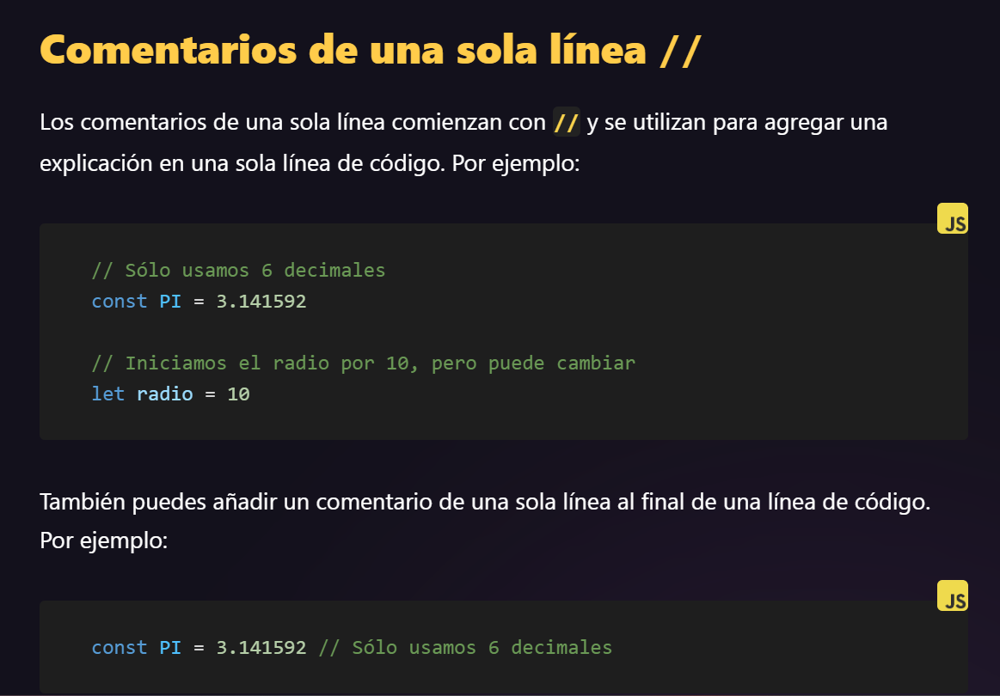
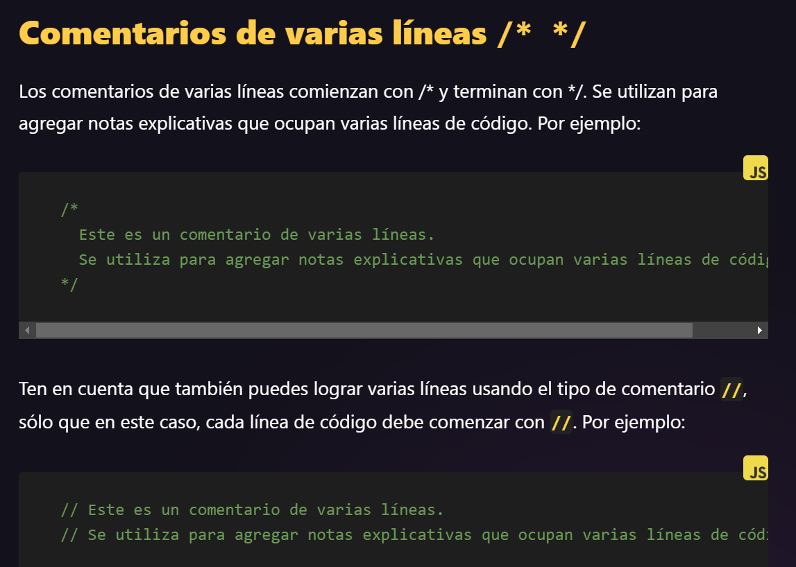
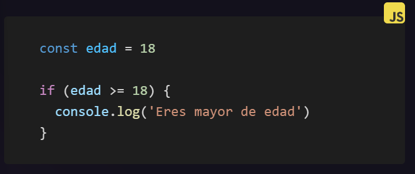

# Variables 
En JS se encuentra las siguientes variables para usar a la hora de programar.

## Ejemplo
1. **let**
> Es la variable en donde podemos usar o asignar cualquier valor.

2. **Const**
> Las constantes son variables que no pueden ser reasignadas.

3. **null and udefined**
> El tipo null sólo puede tener el valor null y el tipo undefined sólo puede tener el valor undefined.

4. **operador typeof**
> El operador typeof devuelve una cadena de texto que indica el tipo de un operando. Puede ser usado con cualquier tipo de operando, incluyendo variables y literales.

5. **comentarios**
> Los comentarios son útiles para explicar el por qué del código, documentar los cambios realizados en el código y hacer que el código sea más fácil de entender para otros desarrolladores. Hay dos tipos de comentarios en JavaScript: los comentarios de una sola línea y los comentarios de varias líneas.

## Estructuras de control

> Controla el flujo de ejecución de tu programa con condicionales y bucles.

1. **Código Condicional**

> Controla el flujo de ejecución de tu programa con condicionales y bucles.
> En JavaScript usamos la palabra reservada if para crear un bloque condicional, así:

### Ejemplo

> Imagina que quieres mostrar un mensaje si la edad de un usuario es mayor o igual a 18 años. Podrías hacerlo así:

